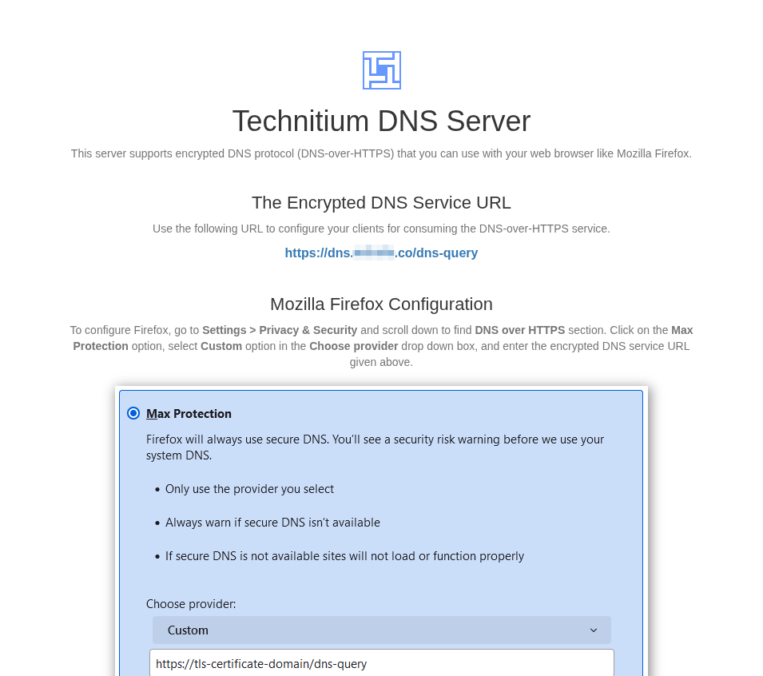

# Technitium Letsencrypt with Cloudflare

This document will walk through the steps to setup Letsencrypt with DoH and Cloudflare. _This guide assumes you have a working Technitium install, are running on at least Debian 13 and have a properly configured Cloudflare API token_.

## Install required packages

On a `root` shell run the following to install the certbot packages needed to use `DNS-01` challenges.
```
apt install certbot python3-certbot-dns-cloudflare -y
```
## Configure certbot

Create script to run on a sucessful certificate deploy that will generate an updated pfx cert for Technitium and restart its service.
```
mkdir -p /etc/letsencrypt/renewal-hooks/deploy
vim /etc/letsencrypt/renewal-hooks/deploy/pkcs12convert.sh
```
* Paste the following into the file. Replace `domain.com` with your domain. You can update the `passout` as well. Save that as you'll need to add that to the Technitium interface to use the newly created cert.
```
#!/usr/bin/env sh

# generate pfx from certs
openssl pkcs12 -export -out /etc/letsencrypt/live/domain.com/cert.pfx \
        -inkey /etc/letsencrypt/live/domain.com/privkey.pem \
        -in /etc/letsencrypt/live/domain.com/cert.pem \
        -certfile /etc/letsencrypt/live/domain.com/chain.pem \
        -passout pass:changeme

# restart technitium
systemctl restart dns

echo "pkcs#12 generated!"
```
* Create a local certbot secret with the Cloudflare API token in it. This should be done as the `root` user for simplicity.
```
mkdir -p ~/.secrets/certbot
echo "dns_cloudflare_api_token = YOUR_API_TOKEN" > ~/.secrets/certbot/cloudflare.ini
chmod 600 ~/.secrets/certbot/cloudflare.ini
```

## Request cert

Request cert manually for initial deployment. Replace `domain.com` with your domain and `user@domain.com` with the appropriate email address.
```
certbot certonly --dns-cloudflare \
  --dns-cloudflare-credentials ~/.secrets/certbot/cloudflare.ini \
  -d domain.com \
  -d *.domain.com \
  --agree-tos \
  --email user@domain.com \
  --non-interactive
```

## Configure Technitium

* Configure Cert in Technitium.

Launch the Technitium management interface then go to `Settings -> Optional Protocols`, then scroll to the bottom of the page and modify `TLS Certificate File Path` to the following. Modify `domain.com` to your domain and enter the password that you used in the script in step 2 in the `TLS Certificate Password` field. Once you have done that, go ahead and click `Save Settings` at the bottom of the page.


* Configure DoH, DoT, and DoQ.

On the same page from step 5, enable the following services to make use of the new cert.
 - `DNS-over-HTTP`
 - `DNS-over-TLS`
 - `DNS-over-HTTPS`
 - `DNS-over-HTTPS/3`
 - `DNS-over-QUIC`


## Test new configuration

1. Test interface to ensure it's functioning correctly now.

Browse to the url of your Technitium DNS server. You should have something like dns.domain.com setup. Your browser should not show any issues with the site when visiting the URL.


and your informational page should now load showing your users how to congfigure their browser to point to the new secure DNS endpoint.



2. Test dns resolution on new protocols.

Use `dig` to test `DoT`.
```
dig @dns.domain.com +tls domain.com|tail -5
```
In the output the following and we can see a successful query.
```
;; Query time: 2 msec
;; SERVER: 192.168.0.8#853(dns.domain.com) (TLS)
;; WHEN: Tue Dec 23 18:02:29 EST 2025
;; MSG SIZE  rcvd: 54
```

Use `dig` to test `DoH`.
```
dig @dns.domain.com +https domain.com|tail -5
```
In the output the following and we can see a successful query.
```
;; Query time: 3 msec
;; SERVER: 192.168.0.8#443(dns.domain.com) (HTTPS)
;; WHEN: Tue Dec 23 18:04:20 EST 2025
;; MSG SIZE  rcvd: 54
```

## Certbot timer information

Certbot, when installed on Debian 13, will install a systemd timer that runs `certbot renew` twice a day. See snippet below.
```
root@dns:~# systemctl cat certbot.timer
# /usr/lib/systemd/system/certbot.timer
[Unit]
Description=Run certbot twice daily

[Timer]
OnCalendar=*-*-* 00,12:00:00
RandomizedDelaySec=43200
Persistent=true

[Install]
WantedBy=timers.target
```
Which you can see calls the `certbot.service` below which runs the `ExecStart` for the `certbot renew` command.
```
root@dns:~# systemctl cat certbot.service
# /usr/lib/systemd/system/certbot.service
[Unit]
Description=Certbot
Documentation=file:///usr/share/doc/python-certbot-doc/html/index.html
Documentation=https://certbot.eff.org/docs
[Service]
Type=oneshot
ExecStart=/usr/bin/certbot -q renew --no-random-sleep-on-renew
PrivateTmp=true
```

## References
* [Hosting DoH, DoT, and DoQ services](https://blog.technitium.com/2020/07/how-to-host-your-own-dns-over-https-and.html)
* [Setting up DoH on Technitium with Cloudflare](https://ambientnode.uk/setting-up-dns-over-https-on-technitium-with-cloudflare)
